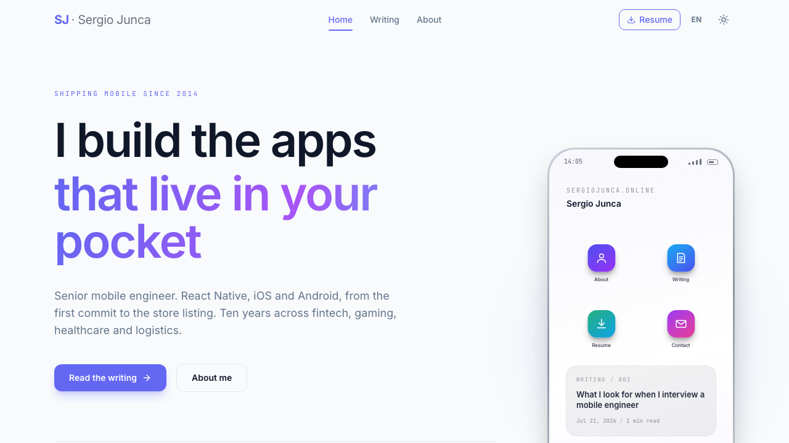
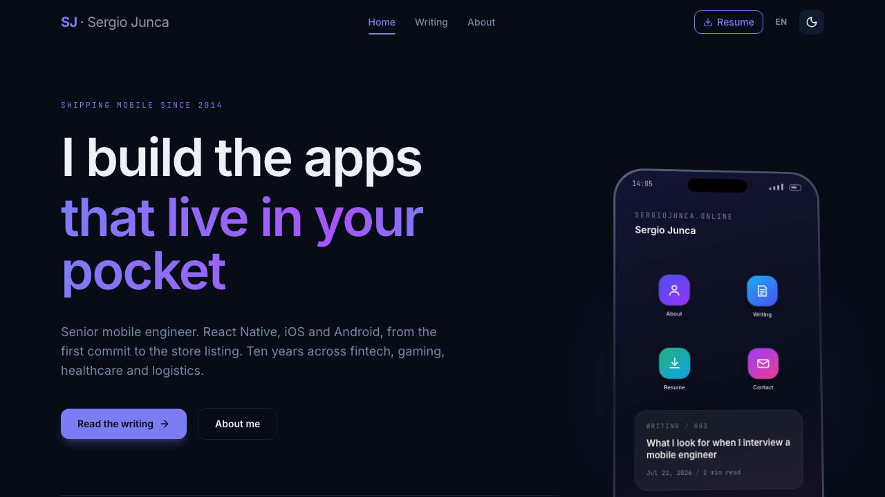
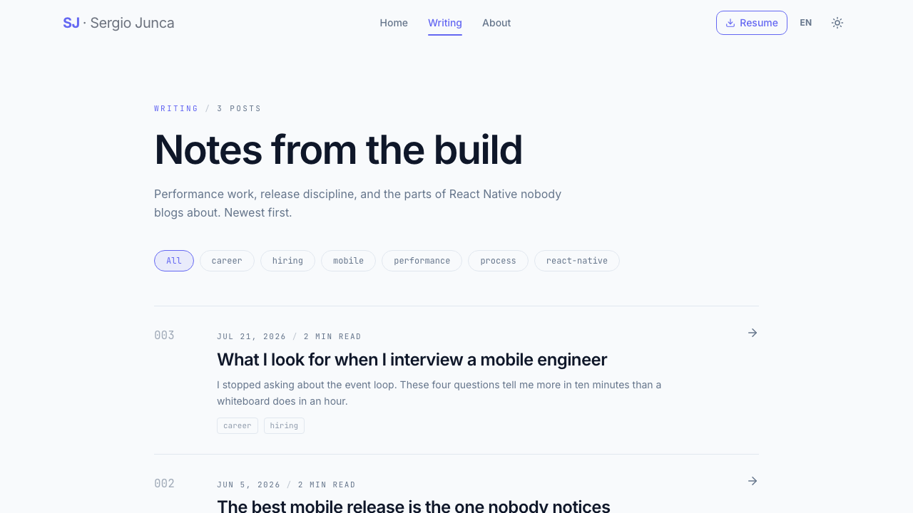
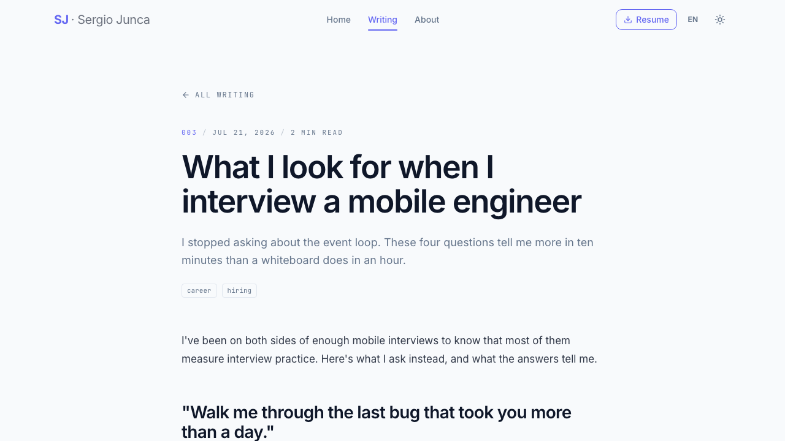
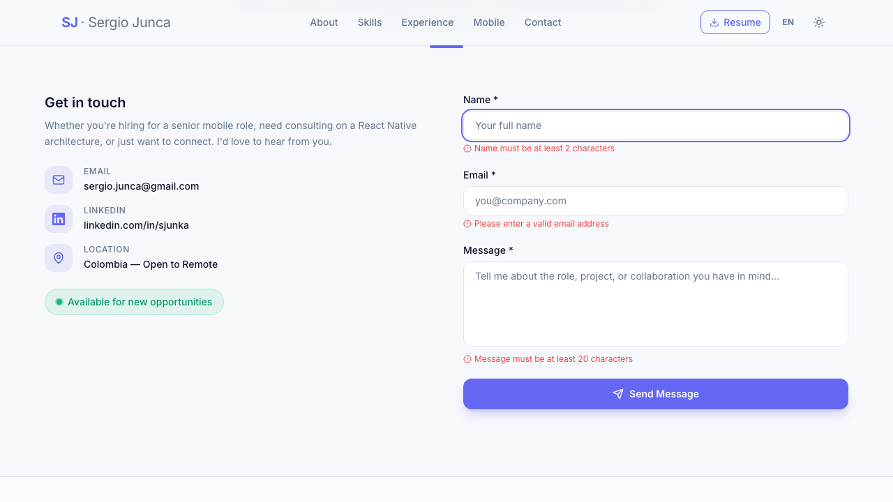
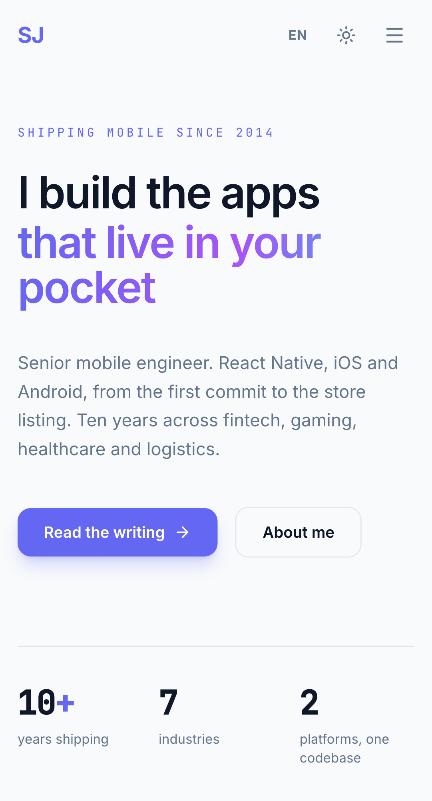
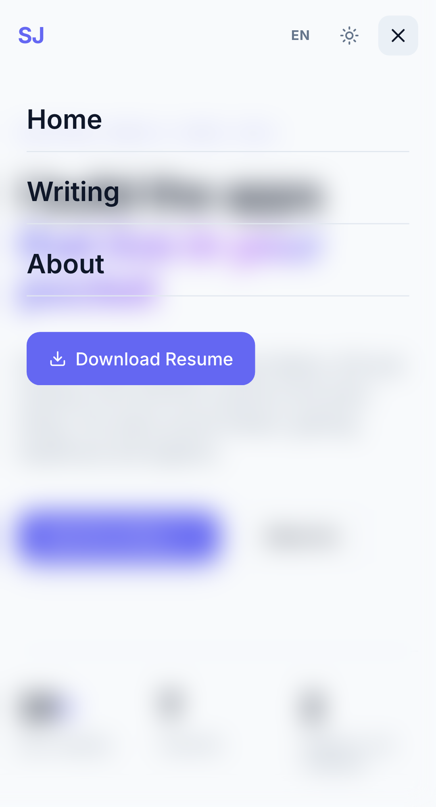
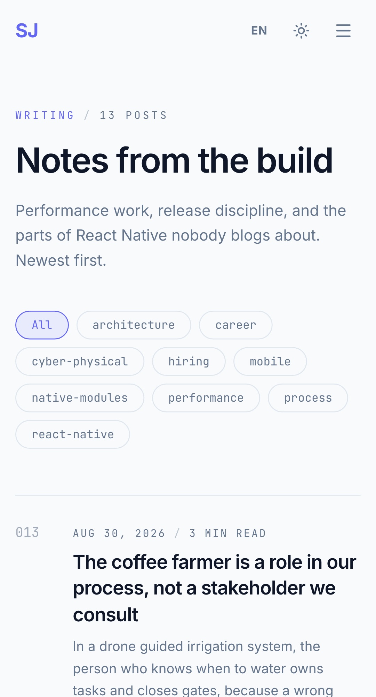

# sergiojunca.online

Personal site and writing of Sergio Junca — senior mobile engineer. React 19,
TypeScript end to end, Vite, Tailwind, deployed to GitHub Pages.

Bilingual (English/Spanish) from one content tree, light and dark from one token
set, and no server: the whole site is static files, including the per-route
`200`s that make deep links indexable.

> **Here to look around?** [**Publishing a post**](#publishing-a-blog-post) ·
> [**Quick start**](#quick-start) · [**Testing**](#testing) ·
> [**Limitations**](#known-limitations)

## The site

| Landing, light | Landing, dark |
| --- | --- |
|  |  |

The hero is a phone. Its home screen is real navigation — the four app tiles open
the site's sections, and the widget links the newest post. It swaps to a writing
screen as you reach the writing section, tilts toward the cursor on pointer
devices, and follows the theme toggle, because a device mockup that ignores the
theme reads as a broken image.

| Writing index | Blog post |
| --- | --- |
|  |  |

| About page | Contact form, error state |
| --- | --- |
|  |  |

| Mobile landing | Mobile menu | Mobile writing index |
| --- | --- | --- |
|  |  |  |

Screenshots are generated by `npm run test:e2e:screenshots` from the built site.
Refresh them after a UI change rather than editing them by hand.

## The share card


What WhatsApp, LinkedIn and X show when the link is pasted. It is a source file,
`scripts/og-card.html`, rendered to `public/share-card.jpg` by `npm run og` through
the Playwright already installed for the e2e suite — so it stays reviewable in a
diff instead of living as an opaque binary.

```sh
npm run og   # edit scripts/og-card.html first, then commit the jpg
```

Two things the suite guards, because both fail silently in production:
`og:image` has to resolve to a real jpeg, and the file's true dimensions have to
match the declared `og:image:width`/`height` or WhatsApp recrops it to a
thumbnail. Rename the file when the design changes — those platforms cache a
preview by image URL for weeks, so a redesign under the old name never ships.

## How it's put together

| Concern | Where |
| --- | --- |
| Routes: landing, about, blog index, post, 404 | `src/pages/`, `src/App.tsx` |
| Landing phone: home/writing screens, GSAP entrance, cursor tilt | `src/components/landing/Phone.tsx` |
| Posts: frontmatter, numbering, reading time, language fallback | `src/lib/posts.ts`, `src/content/blog/` |
| Theme and design tokens, including the phone's own | `src/styles/globals.css`, `src/hooks/useTheme.ts` |
| Language: dictionaries and provider | `src/i18n/`, `src/context/LanguageContext.tsx` |
| Per-route SEO, Open Graph, JSON-LD | `src/components/shared/SEOHead.tsx` |
| Static routes, sitemap, `404.html` | `scripts/postbuild.mjs` |
| Share card source and renderer | `scripts/og-card.html`, `scripts/og.mjs` |

Two things worth knowing before editing them:

- **Theme and language resolve before first paint.** An inline script in
  `index.html` reads `localStorage` and stamps the class on `<html>`, so nobody
  gets a flash of the wrong theme. React never owns that first frame.
- **`index.html` carries no canonical tag.** `SEOHead` emits one per route, and
  on React 19 `react-helmet-async` delegates to React's head hoisting, which does
  not replace tags already in the file — a static canonical would leave every URL
  serving two. The og/twitter tags do stay, because social crawlers don't run JS.

## Publishing a blog post

Add a markdown file to `src/content/blog/` named `<slug>.<lang>.md`, where lang is
`en` or `es`. Commit to `main` and the GitHub Action builds and deploys it.

```markdown
---
title: Your FlatList isn't slow, your renderItem is
date: 2026-04-18
summary: One sentence that sells the read. Used on cards and in link previews.
tags: react-native, performance
---

Body in markdown. Code fences, headings, lists and links are all styled.
```

- Post numbers (`001`, `002`) come from publication order, oldest first. Don't set them.
- Reading time is counted from the body.
- A post with only an `.en.md` file shows to Spanish readers in English with a notice.
  Add `<slug>.es.md` with the same `date` to translate it.
- `npm run build` regenerates `dist/sitemap.xml` and writes the `404.html` that makes
  deep links work on GitHub Pages. Don't edit either by hand.

## Quick start

Node 20+.

```sh
npm install
npm run dev       # vite, localhost:5173
```

```sh
npm run build     # tsc -b, vite build, then scripts/postbuild.mjs
npm run preview   # serve the built dist/ exactly as Pages will
```

## Testing

Three layers: Vitest + Testing Library for units and integration, Playwright for
end-to-end against the real production build.

```bash
npm run test           # vitest, watch mode
npm run test:unit      # vitest, one shot
npm run test:coverage  # vitest + v8 coverage report
npm run test:e2e       # playwright, builds and serves dist first
npm run test:e2e:ui    # playwright, interactive runner
npm run test:e2e:report      # open the last HTML report
npm run test:e2e:screenshots # regenerate the images above
npm run test:all       # lint + unit + e2e
npm run doctor         # react-doctor health score
```

### What runs where

| Layer | Runner | Environment | Files | Tests |
| --- | --- | --- | --- | --- |
| Unit | Vitest | jsdom | 7 | 37 |
| Integration | Vitest + Testing Library | jsdom, real router | 2 | 18 |
| E2E | Playwright | Chromium, built `dist/` | 8 | 180 (90 × 2 projects) |

Totals: **55 Vitest tests, 180 Playwright tests** (172 run, 8 skipped by viewport).

### Unit tests

| File | Tests | Covers |
| --- | --- | --- |
| `src/lib/posts.test.ts` | 13 | frontmatter parsing, release numbering, language fallback, reading time, tag list, date formatting |
| `src/lib/utils.test.ts` | 5 | `cn` merging and Tailwind conflict resolution |
| `src/lib/motion.test.ts` | 3 | `prefersReducedMotion` reads the media query live |
| `src/i18n/index.test.ts` | 4 | en/es key parity, no empty strings, no untranslated nav |
| `src/hooks/useTheme.test.ts` | 5 | default, stored value, toggle, DOM class, persistence |
| `src/hooks/useTranslation.test.ts` | 3 | dictionary lookup through the provider |
| `src/components/sections/Contact.test.tsx` | 4 | field rendering, zod validation, label/input wiring |

### Integration tests

Mount the whole `App` — real router, real providers, real content files.

| File | Tests | Covers |
| --- | --- | --- |
| `src/test/integration/routing.test.tsx` | 10 | every route renders, markdown becomes HTML, unknown slug and unknown route, navbar navigation, `aria-current`, skip link |
| `src/test/integration/preferences.test.tsx` | 8 | theme apply/persist/restore, language switch and persistence, mobile menu aria state and scroll lock |

### End-to-end tests

Playwright builds the site, serves `dist/` with `vite preview`, and runs every
spec twice — once as Desktop Chrome (1280×720), once as a Pixel 5 (393×851).

| Spec | Tests/project | Covers |
| --- | --- | --- |
| `e2e/a11y.spec.ts` | 19 | one h1 per page, no skipped heading levels, image alts, labelled icon buttons, keyboard-only navigation, skip link focus, reduced motion, list semantics, `noopener` on external links |
| `e2e/seo.spec.ts` | 16 | one canonical per route pointing at the trailing-slash URL, title/description/og per route, `og:image:alt`, the share card resolving as a real 1200×630 jpeg, article vs website `og:type`, JSON-LD shape, sitemap contents, `404.html`, manifest |
| `e2e/navigation.spec.ts` | 13 | every deep link returns **200** (not the 404 fallback), 404 page, `aria-current`, scroll reset between routes, scrolled navbar background, mobile burger menu |
| `e2e/blog.spec.ts` | 12 | post ordering and numbering, tag filtering, markdown rendered as HTML, prev/next, author links, unknown slug, no script execution from the markdown pipeline |
| `e2e/about.spec.ts` | 11 | all five sections present and named, in-page anchors, deep link into a lazy section, animated counters settle, contact form validation and `aria-invalid`/`aria-describedby` |
| `e2e/preferences.spec.ts` | 9 | theme and language survive a reload, background actually repaints, the landing phone's own tokens flip with it, no wrong-theme flash, Spanish post served, English fallback notice |
| `e2e/landing.spec.ts` | 7 | hero content, landmarks, both CTAs, resume download, zero console errors |
| `e2e/screenshots.spec.ts` | 3 | generates the images above |

Eight tests are viewport-gated: the desktop navbar links and the resume button are
`hidden` below Tailwind's `md`, so the mobile project skips them and covers the same
journeys through the burger menu instead.

### Coverage

`npm run test:coverage`, v8 provider, excluding i18n dictionaries, static data and
entry points:

```
All files          |   81.21 |    74.92 |   84.09 |   83.49
 src/lib           |   94.87 |    73.91 |     100 |     100
 src/pages         |   93.68 |    77.35 |   93.02 |   97.14
 src/context       |   90.47 |       75 |    87.5 |     100
 src/hooks         |      88 |       75 |      80 |     100
 src/components    |   42.85 |       50 |      50 |   42.85
                     ^stmts    ^branch   ^funcs   ^lines
```

Presentational components sit low on purpose — Playwright asserts what they render
in a real browser, which is cheaper to maintain than snapshotting markup in jsdom.

### Failure artifacts

Playwright keeps a trace on first retry, plus a screenshot and video for anything
that fails, under `test-results/`. `npm run test:e2e:report` opens the HTML report.
All three directories are gitignored.

### CI

`.github/workflows/deploy.yml` runs lint, `tsc -b`, the Vitest suite and the full
Playwright suite on every push to `main` and every pull request against it. The
deploy job has `needs: test`, so a red suite blocks the release; pull requests get
the gate without deploying. A failing e2e run uploads its HTML report as a
`playwright-report` artifact, kept for 7 days.

### Health score

`npm run doctor` runs [react-doctor](https://react.doctor). Current score:

```
┌─────┐  100 / 100 Great
│ ^ ^ │  0 errors, 0 warnings
│  ▽  │
└─────┘
```

## Known limitations

Deliberate, with the reasoning:

- **No prerendering.** `postbuild.mjs` writes a real `index.html` at every known
  route, so each URL returns 200 and gets indexed — but the shell is identical,
  so a crawler that doesn't run JS reads the home page's title everywhere.
  Per-route static HTML is the fix; it needs a render step this site hasn't
  earned yet.
- **The share card is a committed binary.** `npm run og` regenerates it, but
  nothing fails if `scripts/og-card.html` changes and the jpg doesn't. Rendering
  it in CI would close that gap.
- **Presentational components are covered end to end, not in units.** See the
  coverage note above. It's a maintenance trade, not an oversight.
- **No screen reader pass.** The suite asserts roles, labels, headings, focus
  order and reduced motion, which is not the same as listening to it in VoiceOver.
